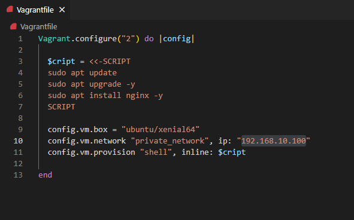
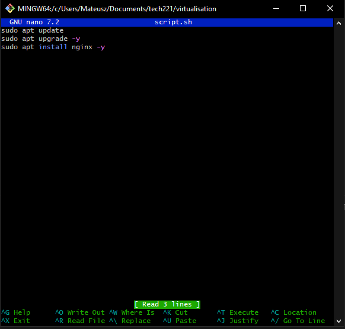
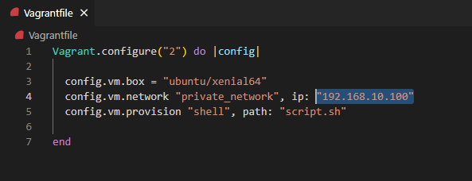
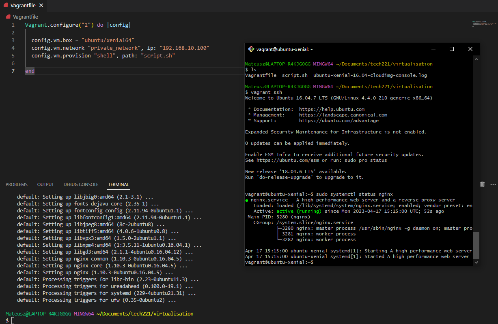
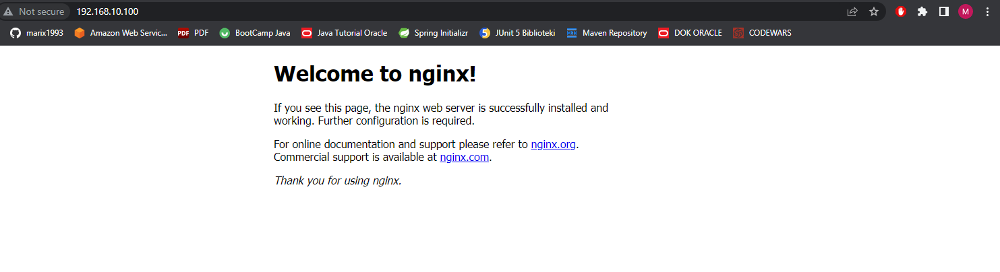

How to provision your Vagrant VM to run Nginx automatically?
-

### To run Nginx automatically we can use two options:

### First:

Perhaps the easiest way to get started is with an 
inline script. An inline script is a script that is given to 
Vagrant directly within the Vagrantfile. An example:

In the code block above, the script block starts with `<<-SCRIPT`
and ends with `SCRIPT`. 
This is known as a "Here Document" or a "heredoc".

To check if it's running we have to use this command 
in our Visual Studio Code terminal `vagrant destroy` & type `y`. After that
we can use `vagrant up`. If everything works properly we should type "192.168.10.100"
into our browser.

### Second:

The shell provisioner can also take an option 
specifying a path to a shell script on the host machine. 
Vagrant will then upload 
this script into the guest and execute it.

#### First we need to create `script.sh` file and do that we can use `GitBash`:
- using `cd` command navigate to Vagrantfile folder.
- use `nano script.sh` command and type in:

- `CTRL + s` to save & `CTRL + x` to close.

#### Next we need to specify a path for shell script in our local machine:

Again to check if everything works we can use command `vagrant destroy` & `vagrant up`.

To double check if everything works in `GitBash` use commands:

`vagrant ssh`

`sudo systemctl status nginx` and paste "192.168.10.100" into browser.

