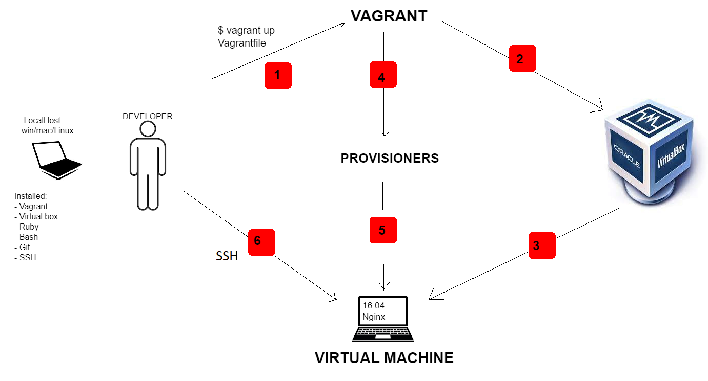
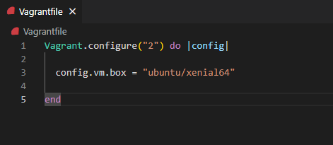
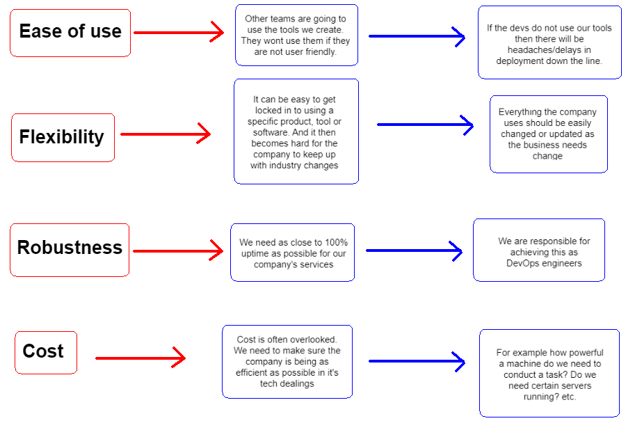
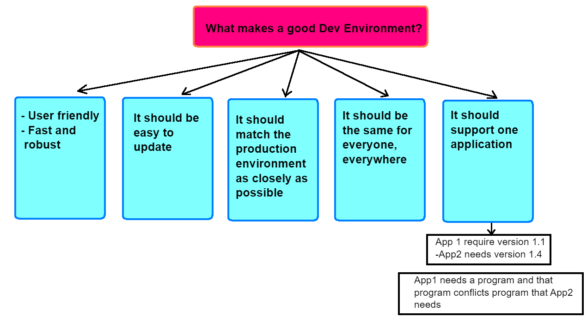

1. What are dev environments?

- In software, web and mobile application development, 
the `development environment` is a workspace with a set 
of processes and programming tools used to develop the 
source code for an application or software product. 
Development environments enable developers to create 
and innovate without breaking something in a live environment.

2. What important features should they have?
 - Important features : compatibility with the 
programming languages and frameworks used in 
the project, support for version control systems, 
easy integration with build and deployment tools, 
and the ability to run and debug code in a 
sandboxed environment.

3. How to create an environment 
- Creating a dev environment typically involves 
installing the necessary software components and 
configuring them to work together. This can be done 
manually, or through the use of tools like Docker, 
Vagrant, or cloud-based services like AWS or Azure.

### Useful Vagrant commands:

- `vagrant init` - Initializes new Vagrant environment in current directory.
- `vagrant up` Starts up your Vagrant environment.
- `vagrant halt` Stops your Vagrant environment.
- `vagrant destroy` Destroys your Vagrant environment and deletes all associated resources.
- `vagrant suspend` Suspend Vagrant environment, saving its current state to disk and freeing memory.
- `vagrant resume` To resume after suspending
- `vagrant ssh` Connects to your Vagrant environment via SSH.
- `vagrant provision` Runs any provisioning scripts that you've specified in your Vagrantfile.

Vagrant / Virtual Box connection
-

1. Install VirtualBox and Vagrant on your computer.
2. Navigate to the directory where you want to create your virtual machine.
3. In Vagrant open the newly created file (tech221/virtualization).
4. Click `Terminal` on top, and then `New terminal`.
5. In the terminal below, on the right hand side click plus and choose `GitBash`.
6. In terminal use command `vagrant init`.
7. To enable auto save go to `File` and check `Auto Save`
8. Delete all the comments and change "basic" for "ubuntu/xenial64".

9. Type the following command to start the virtual machine `vagrant up`. (This will create a new virtual machine in VirtualBox and start it up.)
10. In GitBash find the directory where you have 
virtual machine and type the following command to connect to the virtual machine `vagrant ssh`.
  (This will open an SSH connection to the virtual machine, allowing you to interact with it from the command line).
11. To destroy Vagrant Environment type `vagrant destroy` command in Visual Strudio Code terminal

Four pillars of DevOps:
-

What makes a good Dev environment?
-

